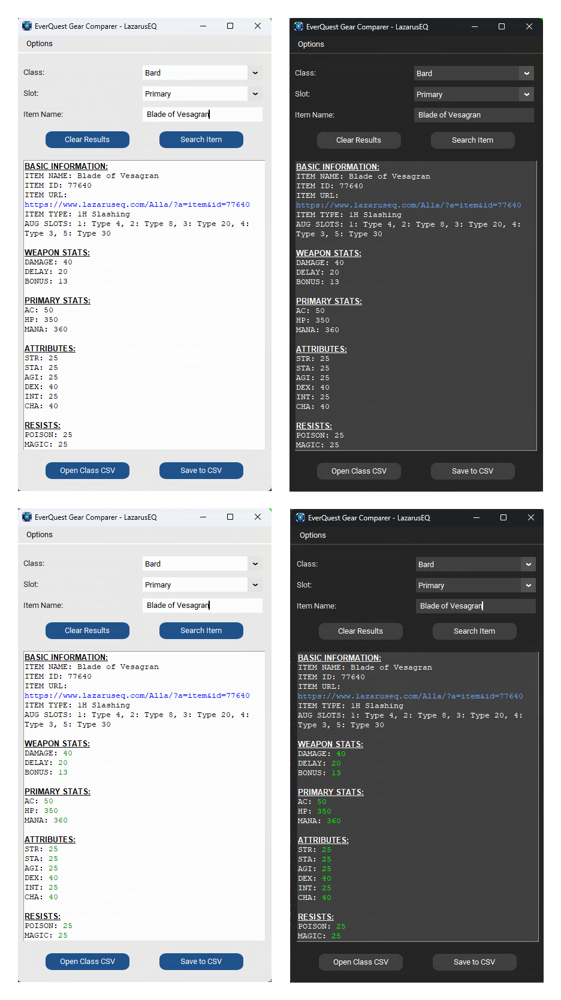
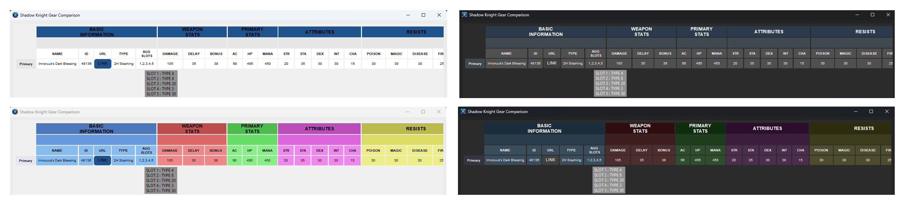
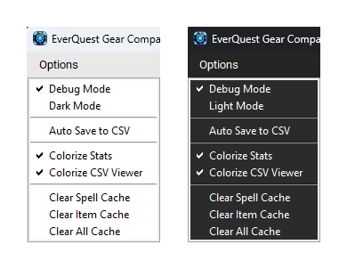

#  LazGearCompare

A desktop application for comparing EverQuest gear stats with a clean, modern interface. For the Project Lazarus Server.

## Table of Contents
- [Key Features](#key-features)
- [Screenshots](#screenshots)
- [Installation](#installation)
- [Requirements](#requirements)
- [Usage](#usage)
- [Options](#options)
- [Support](#support)
- [Contributing](#contributing)
- [License](#license)
- [Antivirus Notice](#antivirus-false-positive-notice)
- [Acknowledgments](#acknowledgments)

## Key Features
- **Modern Interface**: Clean, customizable UI with dark/light mode support
- **Comprehensive Stats**: Detailed item statistics with optional colorization
- **CSV Integration**: Auto-save and interactive viewer for gear comparison
- **Performance**: Built-in caching system for faster repeated searches
- **User Friendly**: Informative tooltips and context menus where needed

## Screenshots

### Main Window

*Showing all variations - Top row: Light and Dark Mode | Bottom row: Light and Dark Mode with Stats Colorization*

### CSV Viewer

*Top row: Light and Dark Mode with tooltips | Bottom row: Light and Dark Mode with color-coded categories and tooltips*

### Options Menu

*Options menu in Light and Dark Mode*

## Installation

### Option 1: Download the Release
1. Download the latest release from the [Releases](https://github.com/Venoryk/LazGearCompare/releases) page
2. Note: Some antivirus software may flag the executable as suspicious. This is a known false positive that has been reported. See [Antivirus False Positive Notice](#antivirus-false-positive-notice) below.

### Option 2: Build from Source
If you prefer to build from source or encounter antivirus warnings, follow these steps:

1. Clone the repository

    ```bash
    git clone https://github.com/Venoryk/LazGearCompare.git
    cd LazGearCompare
    ```

2. Create and activate a virtual environment (recommended)

    ```bash
    python -m venv venv
    # Windows
    venv\Scripts\activate
    # Linux/Mac
    source venv/bin/activate
    ```

3. Install required packages

    ```bash
    pip install -r requirements.txt
    ```

4. Run the application

    ```bash
    python main.py
    ```

5. (Optional) Build the executable

    ```bash
    pyinstaller LazGearCompare.spec
    ```

    The executable will be created in the dist folder.

## Requirements
- Python 3.8 or higher
- Required packages (automatically installed with requirements.txt):
    - customtkinter>=5.2.1 - Modern UI framework
    - CTkMessagebox>=2.5 - Custom message boxes
    - pillow>=10.1.0 - Image handling for UI
    - pandas>=2.1.4 - CSV data handling and manipulation
    - requests>=2.31.0 - HTTP requests
    - urllib3>=2.0.7 - HTTP client
    - beautifulsoup4>=4.12.2 - HTML parsing
    - lxml>=4.9.3 - XML/HTML parser (faster than html.parser)
    - pyinstaller>=6.0.0 - (Optional) For building executable

## Usage
1. Select a class (required for CSV saving)
2. Select an equipment slot (required for CSV saving)
3. Enter an item name and click "Search Item" or press Enter
4. View detailed item statistics with optional colorization
5. Items automatically save to CSV if enabled
6. Open the CSV viewer to compare items with color-coded categories
7. Use tooltips in CSV viewer for detailed effect information
8. Toggle between dark and light modes for better visibility
9. Access options menu for additional customization

## Options
- **Debug Mode**: Enable detailed logging for troubleshooting
- **Dark/Light Mode**: Toggle application theme for better visibility
- **Colorize Stats**: Highlight positive/negative values in main window
- **Colorize CSV**: Apply color-coding to CSV viewer categories
- **Auto-save**: Automatically save to CSV when searching items
- **Cache Management**: Clear spell/item caches for fresh data

## Support
If you encounter any issues or have suggestions:
1. Check the [Issues](https://github.com/Venoryk/LazGearCompare/issues) page
2. Enable Debug Mode for detailed logging
3. Submit a new issue with:
   - Steps to reproduce
   - Expected behavior
   - Actual behavior
   - Debug logs if applicable

## Contributing

Feel free to fork the repository and submit pull requests for any improvements.

## License

MIT License

Copyright (c) 2024 Joshua Quillin (Venoryk)

Permission is hereby granted, free of charge, to any person obtaining a copy
of this software and associated documentation files (the "Software"), to deal
in the Software without restriction, including without limitation the rights
to use, copy, modify, merge, publish, distribute, sublicense, and/or sell
copies of the Software, and to permit persons to whom the Software is
furnished to do so, subject to the following conditions:

The above copyright notice and this permission notice shall be included in all
copies or substantial portions of the Software.

THE SOFTWARE IS PROVIDED "AS IS", WITHOUT WARRANTY OF ANY KIND, EXPRESS OR
IMPLIED, INCLUDING BUT NOT LIMITED TO THE WARRANTIES OF MERCHANTABILITY,
FITNESS FOR A PARTICULAR PURPOSE AND NONINFRINGEMENT. IN NO EVENT SHALL THE
AUTHORS OR COPYRIGHT HOLDERS BE LIABLE FOR ANY CLAIM, DAMAGES OR OTHER
LIABILITY, WHETHER IN AN ACTION OF CONTRACT, TORT OR OTHERWISE, ARISING FROM,
OUT OF OR IN CONNECTION WITH THE SOFTWARE OR THE USE OR OTHER DEALINGS IN THE
SOFTWARE.

## Antivirus False Positive Notice

Some antivirus software may flag LazGearCompare.exe as suspicious. This is a known false positive that has been reported to the relevant vendors. The application is completely safe and open source - you can verify this by:

1. Reviewing the source code in this repository
2. Building the executable yourself using PyInstaller
3. Checking the [VirusTotal results](https://www.virustotal.com/gui/file/774f4f6fc6252eadb2098b63e30167b7cf9d33f223bbf4ef70e5095636b3a5b1)

### Why does this happen?
This false positive is triggered by standard Python packaging techniques and is common with PyInstaller-generated executables. The application has been submitted for analysis to antivirus vendors to resolve these false positives.

For more information, see this [StackOverflow thread](https://stackoverflow.com/questions/64788656/exe-file-made-with-pyinstaller-being-reported-as-a-virus-threat-by-windows-defen) regarding the false positives.

### Building from Source
If you prefer, you can build the executable yourself:
1. Clone this repository
2. Install the required dependencies
3. Run PyInstaller with the provided spec file

## Acknowledgments

- EverQuest is a registered trademark of Daybreak Game Company LLC.
- This tool is for educational purposes only.